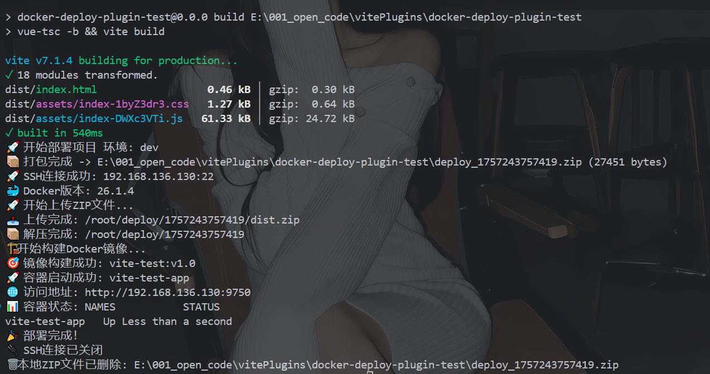
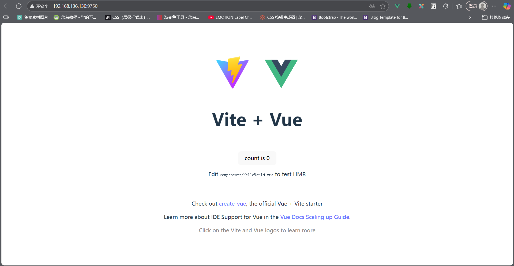
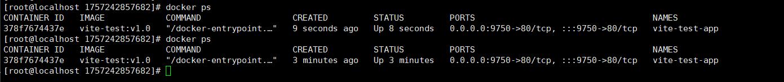
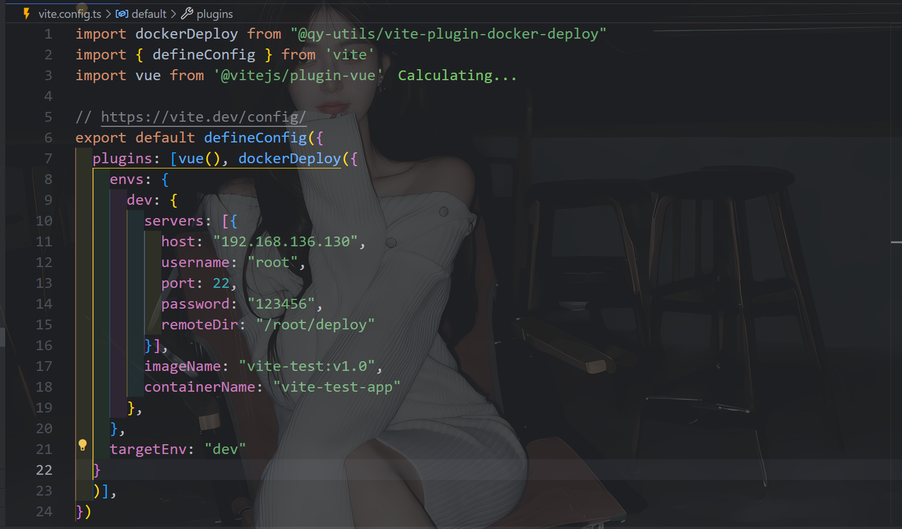

# @qy-utils/vite-plugin-docker-deploy

🚀 一个强大的 Vite 插件，用于自动化 Docker 部署前端项目到远程服务器

[](https://badge.fury.io/js/@qy-utils%2Fvite-plugin-docker-deploy)
[](https://opensource.org/licenses/MIT)
[](https://nodejs.org/)

## ✨ 特性

- 🎯 **一键部署**: 构建完成后自动打包、上传、部署
- 🐳 **Docker 集成**: 自动构建 Docker 镜像并运行容器
- 🌍 **多环境支持**: 支持开发、测试、生产等多环境配置
- 🔒 **SSH 连接**: 支持密码和私钥两种认证方式
- 📊 **实时日志**: 部署过程实时反馈，支持日志文件记录
- 🔄 **自动清理**: 智能清理旧容器和镜像，避免资源浪费
- ⚡ **高效压缩**: 使用最高级别压缩，减少传输时间
- 🛡️ **错误处理**: 完善的错误处理和资源清理机制

## 📦 安装

```bash
npm install @qy-utils/vite-plugin-docker-deploy --save-dev
```

或者使用 pnpm:

```bash
pnpm add @qy-utils/vite-plugin-docker-deploy -D
```

## 🚀 快速开始

### 1. 创建 Dockerfile

在项目根目录创建 `Dockerfile`：

```dockerfile
FROM nginx:alpine
COPY dist/ /usr/share/nginx/html/
EXPOSE 80
CMD ["nginx", "-g", "daemon off;"]
```

### 2. 配置 vite.config.ts

```typescript
import dockerDeploy from '@qy-utils/vite-plugin-docker-deploy'
import vue from '@vitejs/plugin-vue'
import { defineConfig } from 'vite'

export default defineConfig({
  plugins: [
    vue(),
    dockerDeploy({
      // 目标部署环境
      targetEnv: 'production',
      // 多环境配置
      envs: {
        production: {
          servers: [{
            host: '192.168.1.100',
            port: 22,
            username: 'root',
            password: 'your-password',
            remoteDir: '/root/deploy'
          }],
          imageName: 'my-app:latest',
          containerName: 'my-app-container'
        },
        test: {
          servers: [{
            host: '192.168.1.101',
            port: 22,
            username: 'root',
            password: 'test-password',
            remoteDir: '/root/test-deploy'
          }],
          imageName: 'my-app:test',
          containerName: 'my-app-test'
        }
      },
      // 可选配置
      logDir: './logs',
      onProgress: (msg) => {
        console.log('部署进度:', msg)
      },
      onSuccess: (env, server) => {
        console.log(`✅ 部署成功! 环境: ${env}, 服务器: ${server.host}`)
      },
      onError: (env, server, error) => {
        console.error(`❌ 部署失败! 环境: ${env}, 错误:`, error)
      }
    })
  ]
})
```

### 3. 执行部署

```bash
npm run build
```

构建完成后，插件会自动执行部署流程。

## 📸 效果展示

### 部署成功界面


### 网站访问效果


### Linux 服务器响应


### Vite 配置示例


## ⚙️ 配置选项

### DockerDeployOptions

| 参数 | 类型 | 必填 | 默认值 | 说明 |
|------|------|------|--------|------|
| `envs` | `Record<string, EnvConfig>` | ✅ | - | 多环境配置对象 |
| `targetEnv` | `string` | ✅ | - | 目标部署环境名称 |
| `logDir` | `string` | ❌ | `process.cwd()` | 日志文件存储目录 |
| `onProgress` | `(msg: string) => void` | ❌ | - | 部署进度回调 |
| `onSuccess` | `(env: string, server: ServerConfig) => void` | ❌ | - | 部署成功回调 |
| `onError` | `(env: string, server: ServerConfig, err: Error) => void` | ❌ | - | 部署失败回调 |

### EnvConfig

| 参数 | 类型 | 必填 | 默认值 | 说明 |
|------|------|------|--------|------|
| `servers` | `ServerConfig[]` | ✅ | - | 服务器配置列表 |
| `imageName` | `string` | ✅ | - | Docker 镜像名称 |
| `containerName` | `string` | ✅ | - | Docker 容器名称 |
| `buildArgs` | `string[]` | ❌ | - | Docker build 参数 |
| `runArgs` | `string[]` | ❌ | - | Docker run 参数 |
| `cleanupRemote` | `boolean` | ❌ | `true` | 是否清理远程文件 |

### ServerConfig

| 参数 | 类型 | 必填 | 默认值 | 说明 |
|------|------|------|--------|------|
| `host` | `string` | ✅ | - | 服务器 IP 或域名 |
| `port` | `number` | ❌ | `22` | SSH 端口 |
| `username` | `string` | ✅ | - | 登录用户名 |
| `password` | `string` | ❌ | - | 登录密码（与 privateKey 二选一） |
| `privateKey` | `string` | ❌ | - | 私钥路径（与 password 二选一） |
| `remoteDir` | `string` | ✅ | - | 远程部署目录 |

## 🔧 高级配置

### 使用私钥认证

```typescript
servers: [{
  host: '192.168.1.100',
  username: 'root',
  privateKey: '/path/to/your/private/key',
  remoteDir: '/root/deploy'
}]
```

### 自定义 Docker 参数

```typescript
envs: {
  production: {
    // ... 其他配置
    buildArgs: ['--build-arg', 'NODE_ENV=production']
    runArgs: ['-p', '8080:80', '--restart', 'always']
  }
}
```

### 多服务器部署

```typescript
servers: [
  {
    host: '192.168.1.100',
    username: 'root',
    password: 'password1',
    remoteDir: '/root/deploy'
  },
  {
    host: '192.168.1.101',
    username: 'root',
    password: 'password2',
    remoteDir: '/root/deploy'
  }
]
```

## 📋 部署流程

1. **📦 打包阶段**: 将 `dist` 目录和 `Dockerfile` 打包成 ZIP 文件
2. **🔗 连接服务器**: 通过 SSH 连接到目标服务器
3. **🐳 检查环境**: 验证服务器 Docker 环境
4. **📤 上传文件**: 将 ZIP 文件上传到服务器
5. **📂 解压文件**: 在服务器上解压部署文件
6. **🏗️ 构建镜像**: 使用 Dockerfile 构建 Docker 镜像
7. **🚀 运行容器**: 停止旧容器，启动新容器
8. **✅ 验证部署**: 检查容器运行状态
9. **🧹 清理资源**: 清理临时文件和 SSH 连接

## 📝 日志记录

插件会在指定目录生成详细的部署日志：
